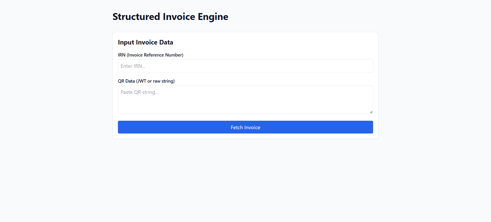
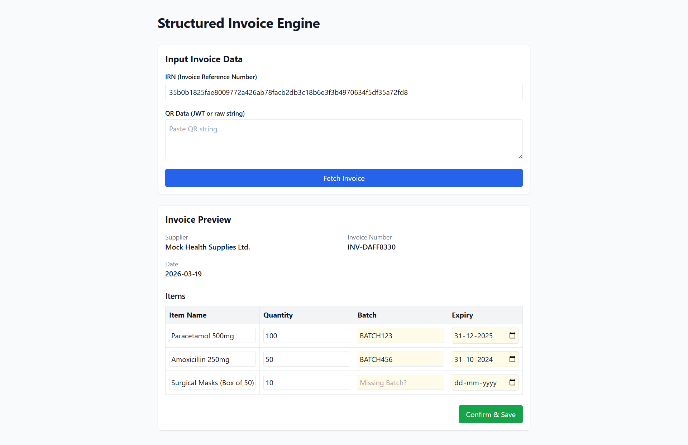

# Structured Invoice Processing Engine 🧾🤖

An AI-enhanced structured invoice processing engine designed to replace manual data entry with structured, assisted input. This system is tailored for real-world workflows like healthcare inventory, evolving from an OCR-first approach to robust structured data ingestion (GST QR / IRN).

## Screenshots

| Input Interface | Assisted Preview & Editing |
| :---: | :---: |
|  |  |

## Features

- **Structured Inputs**: Ingest data directly via GST QR strings (JWT) or IRN (Invoice Reference Number).
- **Assisted Workflow**: Pre-fills fields and allows users to easily edit and confirm data before saving instead of blind auto-saves.
- **Clean Pipeline**: Invoice → Structured Data → Actionable UI.
- **Mock Data Engine**: Includes a mock service for development and testing edge cases (e.g., missing fields, invalid formats) without needing live GST APIs.
- **Data Mapping Layer**: Transformation logic to seamlessly map raw incoming invoices to internal schemas.

## Tech Stack

| Layer         | Tech                                |
|---------------|-------------------------------------|
| Frontend      | React.js, Tailwind CSS, Vite        |
| Backend       | FastAPI (Python), Pydantic          |
| Database      | MongoDB Atlas (Planned)             |
| Deployment    | Vercel (frontend) + Railway (API)   |

## Folder Structure

```text
structured-invoice-processing-engine/
├── client/           # React frontend (Vite + Tailwind)
│   └── src/
│       ├── components/
│       │    ├── InvoiceInput.jsx
│       │    ├── InvoicePreview.jsx
│       │    └── EditableTable.jsx
│       └── pages/
├── server/           # FastAPI backend
│   ├── main.py
│   ├── routes/
│   │    └── invoice.py
│   ├── services/
│   │    ├── mock_invoice_service.py
│   │    ├── invoice_mapper.py
│   │    └── invoice_provider.py
│   └── models/
│        └── invoice.py
└── README.md
```

## Setup Instructions

### Frontend

```bash
cd client
npm install
npm run dev
```

### Backend

```bash
cd server
python -m venv venv
# Windows: venv\Scripts\activate
# Mac/Linux: source venv/bin/activate
pip install fastapi uvicorn pydantic
uvicorn main:app --reload
```

## End Vision & Future Extensions

This project's goal is to become a modular invoice processing system that can plug into real-world workflows like healthcare inventory. Future extensions include:

- CARE HMIS integration (inventory APIs)
- Multi-invoice batch processing
- Analytics dashboard (sales, stock trends)
- Authentication & user roles
- Export to ERP systems

## Contribution
Feel free to fork and contribute to this tool—especially if you're interested in structured data pipelines and building tools for automated workflows.

## License
MIT
---

Built by @muzammil-13 with a mission to help small businesses and healthcare providers go digital.
